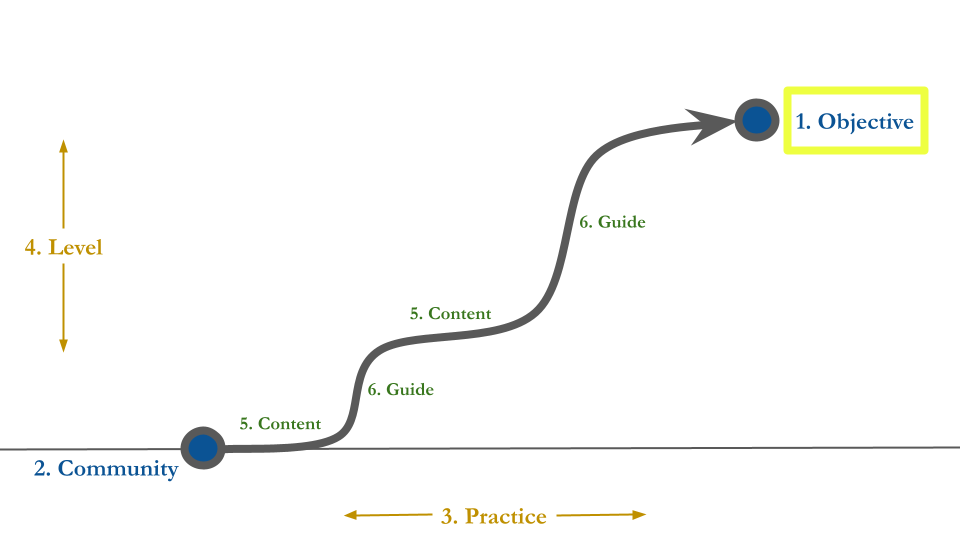

```{r setup, include=FALSE}
usethis::use_git_ignore(c("*.csv", "*.rds"))
options(htmltools.dir.version = FALSE)

library(knitr)
library(tidyverse)
library(xaringan)
library(fontawesome)
```

class: inverse, center, middle

# `r fa("fas fa-images", fill = "#fff")`

**View the slides:** 

[bretsw.com/sevilla23](https://bretsw.com/sevilla23/)

---

class: inverse, center, middle

# `r fa("fas fa-mountain-sun", fill = "#fff")` <br><br> Performance <br> as a Journey

---

# `r fa("fas fa-mountain-sun", fill = "#fff")` Performance as a Journey

```{r, out.width = "100%", echo = FALSE, fig.align = "center"}
include_graphics("img/SDL.png")
```

--

### Self-Directed Learning

---

# `r fa("fas fa-mountain-sun", fill = "#fff")` Performance as a Journey

```{r, out.width = "100%", echo = FALSE, fig.align = "center"}

```

### Self-Directed Learning

---

# `r fa("fas fa-mountain-sun", fill = "#fff")` Performance as a Journey

```{r, out.width = "100%", echo = FALSE, fig.align = "center"}

```

### Self-Directed Learning: **1. Performance Objective**

---

# `r fa("fas fa-mountain-sun", fill = "#fff")` Performance as a Journey

```{r, out.width = "100%", echo = FALSE, fig.align = "center"}

```

### Self-Directed Learning: **2. Home Community**

---

# `r fa("fas fa-mountain-sun", fill = "#fff")` Performance as a Journey

```{r, out.width = "100%", echo = FALSE, fig.align = "center"}

```

### Self-Directed Learning: **3. Practice Opportunities**

---

# `r fa("fas fa-mountain-sun", fill = "#fff")` Performance as a Journey

```{r, out.width = "100%", echo = FALSE, fig.align = "center"}

```

### Self-Directed Learning: **4. Difficulty Level**

---

# `r fa("fas fa-mountain-sun", fill = "#fff")` Performance as a Journey

```{r, out.width = "100%", echo = FALSE, fig.align = "center"}

```

### Self-Directed Learning: **5. Content Area**

---

# `r fa("fas fa-mountain-sun", fill = "#fff")` Performance as a Journey

```{r, out.width = "100%", echo = FALSE, fig.align = "center"}

```

### Self-Directed Learning: **6. External Guide**

---

# `r fa("fas fa-mountain-sun", fill = "#fff")` Performance as a Journey

1. `r fa("far fa-circle-dot", fill = "#782F40")` Performance Objective

2. `r fa("fas fa-house-user", fill = "#782F40")` Home Community

3. `r fa("fas fa-person-walking", fill = "#782F40")` Practice Opportunities

4. `r fa("fas fa-gauge-high", fill = "#782F40")` Difficulty Level

5. `r fa("fas fa-cubes-stacked", fill = "#782F40")` Content Area

6. `r fa("fas fa-people-arrows", fill = "#782F40")` External Guide

---

class: inverse, center, middle

# `r fa("far fa-circle-dot", fill = "#fff")`  <br><br> 1. Performance Objective

---

# `r fa("far fa-circle-dot", fill = "#fff")` 1. Performance Objective

```{r, out.width = "100%", echo = FALSE, fig.align = "center"}

```

--

### Into the New

--

- **New Job:** beginning teachers entering the profession

---

# `r fa("far fa-circle-dot", fill = "#fff")` 1. Performance Objective

```{r, out.width = "100%", echo = FALSE, fig.align = "center"}

```

### Into the New

- **New Task:** Generative AI applications in education

---

# `r fa("far fa-circle-dot", fill = "#fff")` 1. Performance Objective

```{r, out.width = "100%", echo = FALSE, fig.align = "center"}

```

### Into the New

- **New Context:** COVID-19 pandemic disruptions

---

class: inverse, center, top

# `r fa("far fa-circle-dot", fill = "#fff")` <br><br> 1. Performance Objective <br><br> `r fa("fas fa-person-falling", fill = "#fff")` Peril

<hr>

--

**Lack of self-reflection `r fa("fas fa-arrows-left-right", fill = "#fff")` Analysis paralysis**

<hr>

--

`r fa("fas fa-person-falling", fill = "#fff")` Unclear goals: lack of direction

--

`r fa("fas fa-person-falling", fill = "#fff")` Too many options: Trouble getting started


---

class: inverse, center, middle

# `r fa("fas fa-house-user", fill = "#fff")` <br><br> 2. Home Community

---

# `r fa("fas fa-house-user", fill = "#fff")` 2. Home Community

```{r, out.width = "100%", echo = FALSE, fig.align = "center"}
include_graphics("img/2-character-builder.png")
```

--

### Start from strength

--

- Deep roots in backstory, experiences, and people

---

# `r fa("fas fa-house-user", fill = "#fff")` 2. Home Community

```{r, out.width = "100%", echo = FALSE, fig.align = "center"}
include_graphics("img/2-character-builder.png")
```

### Start from strength

- Character builder: Knowledge, skills, and abilities (KSAs)

---

# `r fa("fas fa-house-user", fill = "#fff")` 2. Home Community

```{r, out.width = "100%", echo = FALSE, fig.align = "center"}
include_graphics("img/2-character-builder.png")
```

### Start from strength

- Reasons for wanting to be a teacher, favorite teachers growing up

---

class: inverse, center, top

# `r fa("fas fa-house-user", fill = "#fff")` <br><br> 2. Home Community <br><br> `r fa("fas fa-person-falling", fill = "#fff")` Peril

<hr>

--

**Too little self `r fa("fas fa-arrows-left-right", fill = "#fff")` Too much self**

<hr>

--

`r fa("fas fa-person-falling", fill = "#fff")` Social comparison and lack of confidence in strengths

--

`r fa("fas fa-person-falling", fill = "#fff")` Over-confidence

---

class: inverse, center, middle

# `r fa("fas fa-quote-left", fill = "#fff")` 

"Back to the Instagram thing, I do follow some teacher accounts. Sometimes I feel like, it makes me feel like a crappy teacher, because I’m seeing them do all these things. And I’m like, 'I’m tired right now. If I did all those things, I would either never sleep, or I would be just doing those things." 

~ Anne


---

class: inverse, center, middle

# `r fa("fas fa-person-walking", fill = "#fff")` <br><br> 3. Practice Opportunities

---

# `r fa("fas fa-person-walking", fill = "#fff")` 3. Practice Opportunities

```{r, out.width = "720px", echo = FALSE, fig.align = "center"}

```

--

### `r fa("fas fa-quote-left", fill = "#782F40")` 

"I wish there was a way to use social media like, 'Here's a problem I'm dealing with; can people help me with this problem?'" ~ Julie

---

# `r fa("fas fa-person-walking", fill = "#fff")` 3. Practice Opportunities

```{r, out.width = "680px", echo = FALSE, fig.align = "center"}
include_graphics("img/social-media.jpg")
```

**Social Media Ecosystem**

--

- Many spaces where beginning teachers can search and connect

---

# `r fa("fas fa-person-walking", fill = "#fff")` 3. Practice Opportunities

```{r, out.width = "680px", echo = FALSE, fig.align = "center"}
include_graphics("img/classroom.jpg")
```

**Development of Pedagogical Content Knowledge (PCK)**

---

# `r fa("fas fa-person-walking", fill = "#fff")` 3. Practice Opportunities

```{r, out.width = "540px", echo = FALSE, fig.align = "center"}
include_graphics("img/classroom.jpg")
```

**Pedagogical knowledge:** *How* to teach

--

- deepening understanding

--

- practicing skills

--

- reviewing concepts

---

# `r fa("fas fa-person-walking", fill = "#fff")` 3. Practice Opportunities

```{r, out.width = "540px", echo = FALSE, fig.align = "center"}
include_graphics("img/idea.jpg")
```

**Content knowledge:** *What* to teach

--

- getting ideas and inspiration

--

- staying up-to-date on news and topics

--

- giving students different perspectives

---

# `r fa("fas fa-person-walking", fill = "#fff")` 3. Practice Opportunities

### Reddit: New Teachers

```{r, out.width = "720px", echo = FALSE, fig.align = "center"}
include_graphics("img/3-practice-Reddit-new-teachers.png")
```

---

# `r fa("fas fa-person-walking", fill = "#fff")` 3. Practice Opportunities

### Reddit: ChatGPT

```{r, out.width = "500px", echo = FALSE, fig.align = "center"}

```

---

# `r fa("fas fa-person-walking", fill = "#fff")` 3. Practice Opportunities

### Reddit: ChatGPT

```{r, out.width = "520px", echo = FALSE, fig.align = "center"}

```
---

# `r fa("fas fa-person-walking", fill = "#fff")` 3. Practice Opportunities

```{r, out.width = "100%", echo = FALSE, fig.align = "center"}

```

---

class: inverse, center, top

# `r fa("fas fa-person-walking", fill = "#fff")` <br><br> 3. Practice Opportunities<br><br> `r fa("fas fa-person-falling", fill = "#fff")` Peril

<hr>

--

**Too little motivation `r fa("fas fa-arrows-left-right", fill = "#fff")` Too much motivation**

<hr>

--

`r fa("fas fa-person-falling", fill = "#fff")` Lack of follow through

--

`r fa("fas fa-person-falling", fill = "#fff")` Always connected

--

`r fa("fas fa-person-falling", fill = "#fff")` Context collapse: No distinction between personal and professional


---

class: inverse, center, middle

# `r fa("fas fa-gauge-high", fill = "#fff")` <br><br> 4. Difficulty Level

---

# `r fa("fas fa-gauge-high", fill = "#fff")` 4. Difficulty Level

```{r, out.width = "100%", echo = FALSE, fig.align = "center"}
include_graphics("img/4-level-space.png")
```

---

# `r fa("fas fa-gauge-high", fill = "#fff")` 4. Difficulty Level

### Reddit: New Teachers

```{r, out.width = "100%", echo = FALSE, fig.align = "center"}

```

---

class: inverse, center, top

# `r fa("fas fa-gauge-high", fill = "#fff")` <br><br> 4. Difficulty Level <br><br> `r fa("fas fa-person-falling", fill = "#fff")` Peril

<hr>

--

**Too easy `r fa("fas fa-arrows-left-right", fill = "#fff")` Too hard**

<hr>

--

`r fa("fas fa-person-falling", fill = "#fff")` Boredom

--

`r fa("fas fa-person-falling", fill = "#fff")` Frustration


---

class: inverse, center, middle

# `r fa("fas fa-cubes-stacked", fill = "#fff")` <br><br> 5. Content Area

---

# `r fa("fas fa-cubes-stacked", fill = "#fff")` 5. Content Area

```{r, out.width = "720px", echo = FALSE, fig.align = "center"}
include_graphics("img/5-resources-space.png")
```

--

### `r fa("fas fa-quote-left", fill = "#782F40")` 

"I feel like I filled a lot of gaps. If I couldn't find something, I'd go to social media to find it." ~ Julie

---

# `r fa("fas fa-cubes-stacked", fill = "#fff")` 5. Content Area

### Reddit: ChatGPT

```{r, out.width = "720px", echo = FALSE, fig.align = "center"}

```

---

# `r fa("fas fa-cubes-stacked", fill = "#fff")` 5. Content Area

### X/Twitter: #Edchat

```{r, out.width = "100%", echo = FALSE, fig.align = "center"}

```

---

# `r fa("fas fa-cubes-stacked", fill = "#fff")` 5. Content Area

### X/Twitter: #Edchat

```{r, out.width = "100%", echo = FALSE, fig.align = "center"}

```

---

class: inverse, center, top

# `r fa("fas fa-cubes-stacked", fill = "#fff")` <br><br> 5. Content Area <br><br> `r fa("fas fa-person-falling", fill = "#fff")` Peril

<hr>

--

**Too few resources `r fa("fas fa-arrows-left-right", fill = "#fff")` Too many resources**

<hr>

--

`r fa("fas fa-person-falling", fill = "#fff")` Difficulty finding relevant and useful materials

--

`r fa("fas fa-person-falling", fill = "#fff")` Noisy: Many competing voices and opinions


---

class: inverse, center, middle

# `r fa("fas fa-people-arrows", fill = "#fff")` <br><br> 6. External Guide

---

# `r fa("fas fa-people-arrows", fill = "#fff")` 6. External Guide

```{r, out.width = "100%", echo = FALSE, fig.align = "center"}
include_graphics("img/6-guide-space.png")
```

---

class: inverse, center, middle

# `r fa("fas fa-quote-left", fill = "#fff")` 

"I appreciate the perspective of being able to see what other teachers are dealing with in their district or their state like, 'Are you, are you experiencing these same things?' And they are, and it’s nice to know that you’re not the only one." 

~ Simone

---

# `r fa("fas fa-people-arrows", fill = "#fff")` 6. External Guide

### Reddit: Education-Related Subreddits
```{r, out.width = "420px", echo = FALSE, fig.align = "center"}

```

---

# `r fa("fas fa-people-arrows", fill = "#fff")` 6. External Guide

### X/Twitter: #Edchat

```{r, out.width = "100%", echo = FALSE, fig.align = "center"}

```

---

# `r fa("fas fa-people-arrows", fill = "#fff")` 6. External Guide

### X/Twitter: #Edchat

```{r, out.width = "100%", echo = FALSE, fig.align = "center"}

```

---

class: inverse, center, top

# `r fa("fas fa-people-arrows", fill = "#fff")` <br><br> 6. External Guide <br><br> `r fa("fas fa-person-falling", fill = "#fff")` Peril

<hr>

--

**Too dependent `r fa("fas fa-arrows-left-right", fill = "#fff")` Too independent**

<hr>

--

`r fa("fas fa-person-falling", fill = "#fff")` Over-reliant on others

--

`r fa("fas fa-person-falling", fill = "#fff")` Lack of agency and self-determination of priorities

--

`r fa("fas fa-person-falling", fill = "#fff")` Don't know what you don't know

--

`r fa("fas fa-person-falling", fill = "#fff")` Get stuck


---

class: inverse, center, middle

# `r fa("fas fa-mountain-sun", fill = "#fff")` <br><br> Performance <br> as a Journey

---

# `r fa("fas fa-mountain-sun", fill = "#fff")` Performance as a Journey

### Self-Directed Learning

```{r, out.width = "100%", echo = FALSE, fig.align = "center"}

```

---

# `r fa("fas fa-mountain-sun", fill = "#fff")` Performance as a Journey

### Self-Directed Learning: Next Steps

```{r, out.width = "100%", echo = FALSE, fig.align = "center"}
include_graphics("img/SDL.png")
```

--

**Transfer:** What will you remember tomorrow? What will you put into practice?


---

class: inverse, center, middle

# `r fa("fas fa-question", fill = "#fff")` <br><br> Questions

**What would you like to know more about?**

<hr>

<br><br><br>

`r fa("fas fa-images", fill = "#fff")` **Today's Slides: [bretsw.com/sevilla23](https://bretsw.com/sevilla23/)**

<br><br><br>
<hr>

**Bret Staudt Willet** | Florida State University

`r fa("fas fa-envelope", fill = "#fff")` [bret.staudtwillet@fsu.edu](mailto:bret.staudtwillet@fsu.edu) | `r fa("fas fa-globe", fill = "#fff")` [bretsw.com](https://bretsw.com) | `r fa("fab fa-github", fill = "#fff")` [GitHub](https://github.com/bretsw/)

---

# `r fa("fas fa-book-open", fill = "#fff")` Resources

Auletto, A. (2021). Making sense of early-career teacher support, satisfaction, and commitment. *Teaching and Teacher Education, 102*, 103321. https://doi.org/10.1016/j.tate.2021.103321

Beach, P. (2017). Self-directed online learning: A theoretical model for understanding elementary teachers’ online learning experiences. *Teaching and Teacher Education, 61*, 60–72. https://doi.org/10.1016/j.tate.2016.10.007

Fox, A. & Bird, T. (2017). The challenge to professionals of using social media: Teachers in England negotiating personal-professional identities. *Education and Information Technologies, 22*(2), 647–675. https://doi.org/10.1007/s10639- 015-9442-0 

Francom, G. M. (2010). *International Journal of Self-Directed Learning, 7*(1), 29–44. https://www.oltraining.com/SDLwebsite/IJSDL/IJSDL7.1-2010.pdf#page=34

Keay, J. K., Carse, N., & Jess, M. (2019). Understanding teachers as complex professional learners. *Professional Development in Education, 45*(1), 125–137. https://doi.org/10.1080/19415257.2018.1449004

Knowles, M. S. (1975). *Self-directed learning: A guide for learners and teachers*. Pearson Learning.

---

# `r fa("fas fa-book-open", fill = "#fff")` Resources

Ladson-Billings, G. (1995). Toward a theory of culturally relevant pedagogy. *American Educational Research Journal, 32*, 465−491. https://doi.org/10.3102/00028312032003465

Louws, M. L., Meirink, J. A., van Veen, K., & van Driel, J. H. (2017). Teachers' self- directed learning and teaching experience: What, how, and why teachers want to learn. *Teaching and Teacher Education, 66*, 171–183. https://doi.org/10.1016/j.tate.2017.04.004

Macià, M.,& García, I. (2016). Informal online communities and networks as a source of teacher professional development: A review. *Teaching and Teacher Education, 55*, 291–307. https://doi.org/10.1016/j.tate.2016.01.021

Meredith, T. R. (2016). Game-based learning in professional development for practicing educators: A review of the literature. *TechTrends, 60*, 496–502. https://doi.org/10.1007/s11528-016-0107-7

McChesney, K., & Aldridge, J. M. (2021). What gets in the way? A new conceptual model for the trajectory from teacher professional development to impact. *Professional Development in Education, 47*(5), 834–852. https://doi.org/10.1080/19415257.2019.1667412

---

# `r fa("fas fa-book-open", fill = "#fff")` Resources

Paris, D. (2012). Culturally sustaining pedagogy: A needed change in stance, terminology, and practice. *Educational Researcher, 41*(3), 93–97. https://doi.org/10.3102/0013189X12441244

Staudt Willet, K. B. (2023). Early career teachers’ expansion of professional learning networks with social media. *Professional Development in Education*. https://doi.org/10.1080/19415257.2023.2178481

Teo, T., Tan, S. C., Lee, C. B., Chai, C. S., Koh, J. H. L., Chen, W. L., & Cheah, H. M. (2010). The self-directed learning with technology scale (SDLTS) for young students: An initial development and validation. *Computers and Education, 55*(4), 1764–1771. https://doi.org/10.1016/j.compedu.2010.08.001

Toh, W., & Kirschner, D. (2020). Self-directed learning in video games, affordances and pedagogical implications for teaching and learning. *Computers & Education, 154*, 103912. https://doi.org/10.1016/j.compedu.2020.103912

Yosso, T. J. (2005). Whose culture has capital? A critical race theory discussion of community cultural wealth. *Race Ethnicity and Education, 8*(1), 69-91. https://doi.org/10.1080/1361332052000341006
